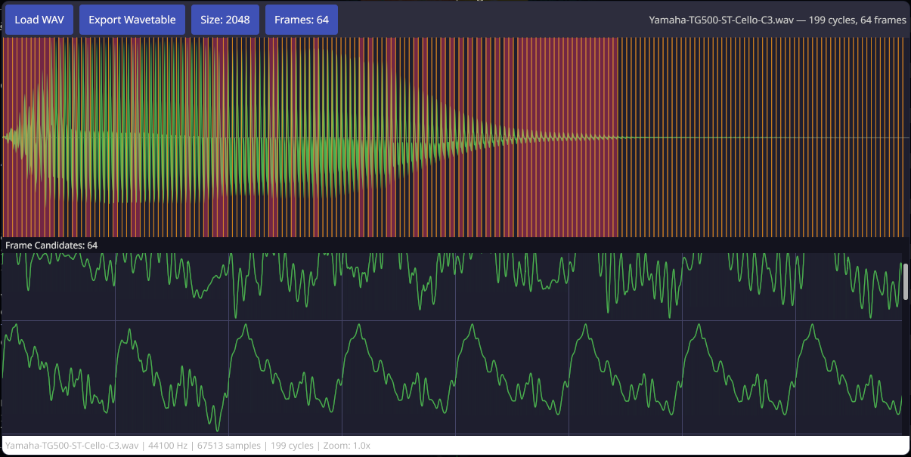

# WaveCleaver

[](LICENSE)

Extract individual audio cycles from WAV files and export them as synthesizer wavetables.



## Features

- Automatic pitch detection (two-pass F0 estimation with octave-jump suppression)
- Zero-crossing-guided cycle detection for clean loop points
- RMSE-based frame candidate selection to pick perceptually distinct cycles
- Interactive waveform editor with zoom, pan, and multi-select
- Scrollable thumbnail strip of detected frame candidates
- Configurable frame size (256–4096 samples) and frame count (8–256 frames)
- Export to **Serum** (WAV + CLM chunk) or **Surge XT** (`.wt` binary format)

## Requirements

- Go 1.21+
- Linux: requires a C compiler and GPU/OpenGL support (standard desktop installs have this)

## Build & Run

```bash
# Build
go build -o wavecleaver .

# Or run directly
go run main.go
```

## Usage

1. **Load WAV** — click _Load WAV_ and pick a mono or stereo WAV file. Stereo is downmixed to mono automatically.
2. **Analysis** — pitch estimation and cycle detection run in the background. A status message shows progress.
3. **Waveform editor**
   - **Scroll** to zoom in/out
   - **Middle-click drag** (or drag on an empty area) to pan
   - **Click** a cycle marker to select/deselect it
   - **Shift-click** to select a range of cycles
4. **Frame candidates panel** — the thumbnail strip below the waveform shows the auto-selected representative cycles. Click thumbnails to toggle selection.
5. **Frame Size / Frames** — click the _Size_ and _Frames_ toolbar buttons to cycle through options. Each click advances to the next value.
6. **Export Wavetable** — click _Export Wavetable_, choose a filename. Use `.wav` for Serum or `.wt` for Surge XT.

## Export Formats

| Extension | Synthesizer | Format details |
|-----------|-------------|----------------|
| `.wav`    | Serum (and compatible) | 32-bit IEEE float WAV with a `clm ` RIFF chunk encoding the frame size |
| `.wt`     | Surge XT    | `vawt` binary format: header + 32-bit float samples |

## Architecture

```
WAV file → audio.LoadWAV() → model.Sample (float64, normalized)
    → dsp.EstimatePitchEnvelope()   [2-pass F0, async]
    → dsp.DetectCycles()             [zero-crossing guided by F0]
    → dsp.GenerateFrameCandidates()  [RMSE-based representative subset]
    → UI renders waveform + cycle overlays
    → user selects cycles
    → audio.ExportWavetable()        [resampled frames + format-specific output]
```

**Packages:**

| Package | Responsibility |
|---------|---------------|
| `app/` | Central controller; owns all state, drives async analysis, handles UI events |
| `dsp/` | Signal processing: pitch estimation, zero-crossing detection, autocorrelation, frame selection |
| `audio/` | File I/O: WAV loading (mono downmix + normalize), wavetable export |
| `model/` | Plain data structs: `Sample`, `Cycles`, `Selection`, `FrameCandidates` |
| `ui/` | Gio widgets: waveform viewport, draw, input, candidate panel, toolbar |
| `util/` | Stateless math helpers: resample, lerp, clamp, next power-of-2 |

## Development

```bash
# Run all tests
go test ./...

# Test a specific package
go test ./dsp/...
```

## Dependencies

| Library | Purpose |
|---------|---------|
| [gioui.org](https://gioui.org) | Immediate-mode GUI framework |
| [go-audio/wav](https://github.com/go-audio/wav) | WAV file decoding |
| [gonum/dsp/fourier](https://pkg.go.dev/gonum.org/v1/gonum/dsp/fourier) | FFT for autocorrelation-based pitch detection |
| [sqweek/dialog](https://github.com/sqweek/dialog) | Native OS file picker dialogs |

## License

WaveCleaver is free software released under the [GNU General Public License v3.0](LICENSE) or later.
